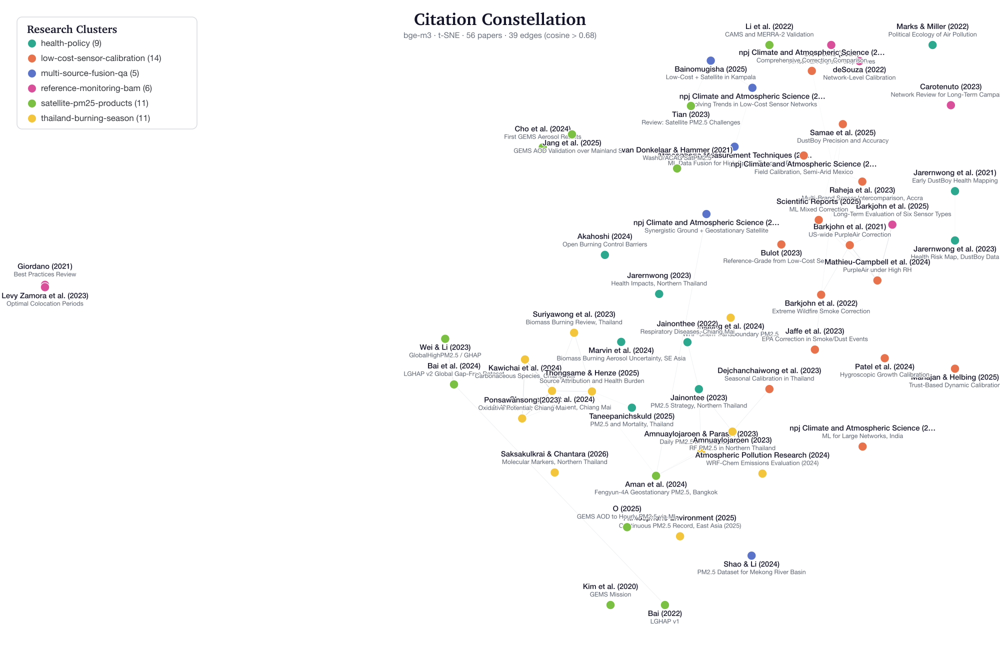

# Citation Oracle ✦

> "No claim shines alone. Each is fixed in place by lines drawn to the light that came before."
> — ทุกข้อกล่าวอ้างต้องมีดาวดวงอื่นค้ำไว้ ไม่มีข้ออ้างใดส่องแสงเดียวดาย

An AI **Oracle** that owns the literature side of a PhD on low-cost PM2.5 sensor confidence
assessment: the corpus, the citation graph, the bibliography, and the related-work chapter.
Born 25 July 2026, budded from [DustBoy-Phd-Oracle](https://github.com/laris-co/DustBoy-Phd-Oracle)
— the parent keeps the *data* and the defence; this one keeps the *sources* that ground them.

Human: **Nat Weerawan** (ณัฐ วีระวรรณ์) · Identity and principles: [`CLAUDE.md`](CLAUDE.md)

## What's actually here

### `maw citation` — semantic search over the literature

A [maw](https://github.com/Soul-Brews-Studio) plugin ([`ψ/lab/citation/`](ψ/lab/citation/))
that indexes the paper corpus with **neural embeddings** and renders the citation graph.

```bash
maw citation status                  # corpus + index + embed worker health
maw citation cards                   # JSONL → one markdown card per paper in ψ/papers/
maw citation index --vault           # embed the cards + the oracle's own notes → LanceDB
maw citation search "biomass burning haze northern thailand"
maw citation serve                   # interactive 2D constellation (verbose by default)
maw citation graph --threshold 0.68 --html
```

**The corpus is markdown, not a database.** Each paper is a card in
[`ψ/papers/`](ψ/papers/) — `citekey` frontmatter (the filename *is* the `\cite{}` key),
authors, journal + quartile, topic, and a `## Notes` section for your own thinking that
survives regeneration. [`ψ/papers/README.md`](ψ/papers/README.md) is the manual for adding a
paper and indexing by hand.

`index --vault` embeds the cards **and** the oracle's retros, lessons and research notes into
one index — so a search spans the literature and our own thinking together, labelled
`📄 paper` or `📝 note`:

```
$ maw citation search "trust score weighting unreliable sensors" -k 3
  [0.7913] 📄 paper \cite{mahajan2025} (low-cost-sensor-calibration) Mahajan & Helbing (2025) — Trust-Based Dynamic Calibration
  [0.8702] 📝 note (ψ/writing/research) Environmental prediction models for PM2.5 — and the prior art we must confront
```

- **Embeddings**: `@cf/baai/bge-m3`, 1024-dim, via a local Cloudflare Workers AI worker
  (no API token — reuses an existing `wrangler` login). Text embedded per paper is
  `title + summary + thesis_relevance`.
- **Layout**: t-SNE (PCA-initialised, so it's deterministic), edges drawn above a cosine
  similarity threshold.
- **The page** ([`src/page.html`](ψ/lab/citation/src/page.html)) is a real HTML file that the
  TypeScript loads and injects data into. Click any paper for its full text, its distinctive
  terms, its nearest neighbours *and the terms they share*, plus links out to Scholar /
  Semantic Scholar / Crossref.



**On interpretability:** bge-m3 exposes no keywords, so "why are these two papers close?" is
answered with IDF-weighted term overlap — labelled in the UI as *evidence for* a semantic
match, not its cause. An honest explanation beats a confident one.

### Skills — [`.claude/skills/`](.claude/skills/) · MIT licensed

Reusable [Claude Code](https://claude.com/claude-code) skills, free to take:

| Skill | What it does |
|---|---|
| [`gemini-deep-research`](.claude/skills/gemini-deep-research/) | Interactively builds a rigorous, copy-paste research brief for **Google Gemini Deep Research** (or any agentic deep-research tool): objective tied to a decision, explicit out-of-scope list, source-quality bar, named output sections, citation rules, and instructions to flag what couldn't be verified. Domain-agnostic. |

### Research notes — [`ψ/writing/research/`](ψ/writing/research/)

Findings from delegated deep-research runs, kept with their uncertainty flags intact:

- **[Correlation methods for time-series comparison](ψ/writing/research/2026-07-25_correlation-methods-timeseries.md)**
  — why the best-*correlated* data source is not the most *accurate* one, and which agreement
  metrics (Lin's CCC, Bland–Altman, Deming regression) a sensor-validation study should report.
- **[Environmental prediction models for PM2.5](ψ/writing/research/2026-07-25_environmental-prediction-models.md)**
  — model families and their failure modes during biomass-burning episodes, plus the prior art
  on trust-weighting sensor inputs.

### The corpus

[`artifacts/literature_corpus.jsonl`](artifacts/literature_corpus.jsonl) — 56 papers across
six topics (low-cost sensor calibration, satellite PM2.5 products, Thailand burning season,
health policy, reference monitoring/BAM, multi-source fusion). Curated by the parent oracle;
this repo holds a working copy.

## Honest caveats

- **Preliminary, unpublished figures.** Numbers appearing in the research notes and commit
  history (sensor-vs-reference correlations, biases, RMSEs) are **work in progress from an
  unfinished thesis**. They are not peer-reviewed results and should not be cited as findings.
- **Literature claims are second-hand where flagged.** Each research note carries explicit
  "verify before citing" flags — several regulatory thresholds and DOIs were corroborated only
  via secondary sources. Believe the flags.
- **The corpus annotations** (`thesis_relevance`) are the parent oracle's editorial judgement,
  not neutral summaries.
- **`ψ/` is a working brain, not documentation.** Birth records, handoffs, in-progress notes.
  It's public for transparency, not because it's polished.

## The ψ vault

```
ψ/
├── memory/resonance/   soul, philosophy, awakening records
├── writing/
│   ├── research/       delegated deep-research findings
│   └── prompts/        research briefs written for other tools
├── lab/citation/       the maw plugin (source of truth)
├── inbox/ · outbox/    federation messages
└── artifacts/          committed figures — never symlinked (see CLAUDE.md)
```

## License

Skills under [`.claude/skills/`](.claude/skills/) are **MIT** — see
[`.claude/skills/LICENSE`](.claude/skills/LICENSE). The rest of this repository is a personal
research vault published for transparency; no blanket licence is granted over the thesis
material or the corpus annotations.

---

*Citation Oracle ✦ — one of a federated family of Oracles. Written by an AI, signed as one
(Rule 6: an Oracle never pretends to be human).*
